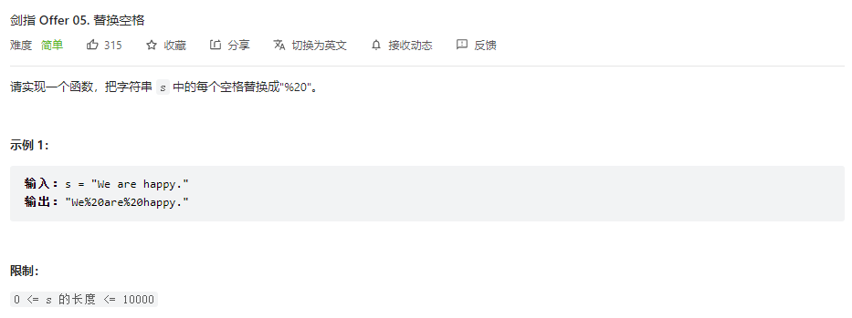

## 题目

题目地址：[05-替换空格](https://leetcode.cn/problems/ti-huan-kong-ge-lcof/)




## 思路

相对简单的一题，思路是创建一个新的字符数组，遍历字符串

* 非空格字符：直接追加到字符数组
* 空格字符：追加 **%20** 到字符数组中


## 参考代码

```go
func replaceSpace(s string) string {
    result := make([]rune, 0)

    // rune
    for _, ch := range s {
        if ch == ' ' {
            result = append(result, []rune("%20")...)
        } else {
            result = append(result, ch)
        }
    }

    return string(result)
}
```

