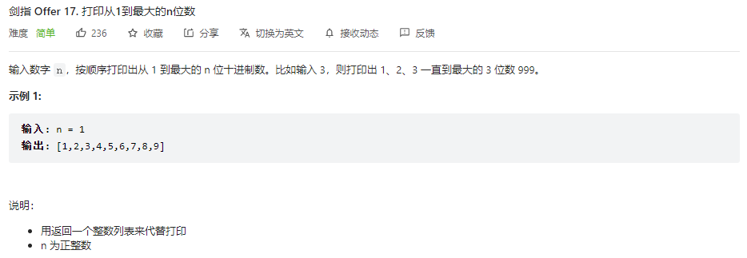

## 题目

题目地址：[17-打印从1到最大的n位数](https://leetcode.cn/problems/da-yin-cong-1dao-zui-da-de-nwei-shu-lcof/)




## 思路

相对简单的一题，思路先求出最大值，然后通过循环将 1~最大值 依次放入切片中即可，最大值可以用 10^n - 1 得到

注意点：LeetCode 中可以直接使用常见的标准库，无需导入


## 视频地址

https://www.bilibili.com/video/BV1jt4y1t7WA


## 参考代码

```go
func printNumbers(n int) []int {
    maxValue := int(math.Pow10(n))

    result := make([]int, 0)

    for i := 1; i <= maxValue - 1; i++ {
        result = append(result, i)
    }

    return result
}
```

