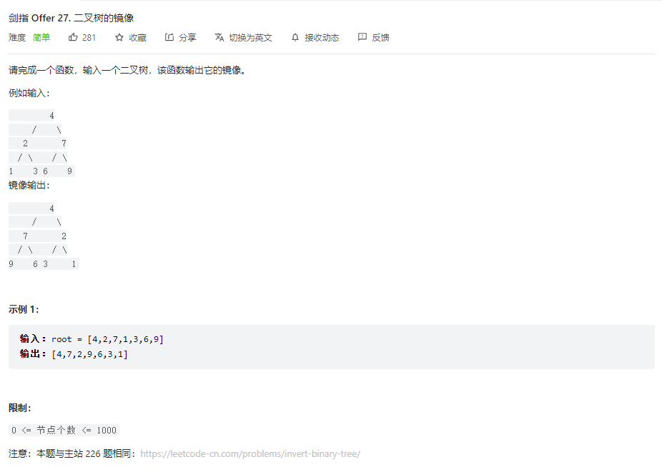

## 题目

题目地址：[27. 二叉树的镜像 ](https://leetcode.cn/problems/er-cha-shu-de-jing-xiang-lcof/)




## 思路

二叉树的相关问题，大部分情况下都可以使用递归解决

使用递归的三个注意点

* 明确递归函数的作用，以及递归函数的参数和返回值
* 在递归函数中使用递归函数，不要死扣细节
* 确定递归终止条件


## 视频地址

https://www.bilibili.com/video/BV1FN4y177M4


## 参考代码

```go
/**
 * Definition for a binary tree node.
 * type TreeNode struct {
 *     Val int
 *     Left *TreeNode
 *     Right *TreeNode
 * }
 */
func mirrorTree(root *TreeNode) *TreeNode {
    // 明确递归函数的作用，以及递归函数的参数和返回值
    // 在递归函数中使用递归函数，不要死扣细节
    // 确定递归终止条件
    if root == nil {
        return root
    }

    tmp := root.Right
    root.Right = mirrorTree(root.Left)
    root.Left = mirrorTree(tmp)

    return root
}
```

