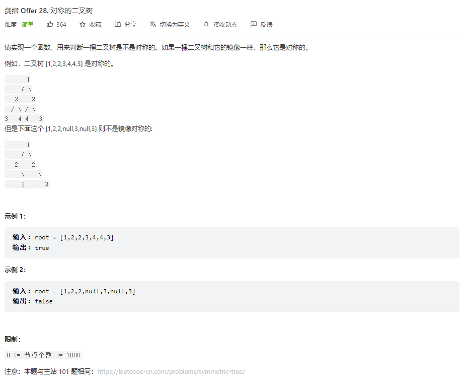

## 题目

题目地址：[28. 对称的二叉树](https://leetcode.cn/problems/dui-cheng-de-er-cha-shu-lcof/)




## 思路

二叉树的相关问题，大部分情况下都可以使用**递归**解决

使用递归的三个注意点

* 明确递归函数的作用，以及递归函数的参数和返回值
* 在递归函数中使用递归函数，不要死扣细节
* 确定递归终止条件


## 视频地址

https://www.bilibili.com/video/BV18B4y187Ed


## 参考代码

```go
/**
 * Definition for a binary tree node.
 * type TreeNode struct {
 *     Val int
 *     Left *TreeNode
 *     Right *TreeNode
 * }
 */
func isSymmetric(root *TreeNode) bool {
    // * 明确递归函数的作用，以及递归函数的参数和返回值
    // * 在递归函数中使用递归函数，不要死扣细节
    // * 确定递归终止条件

    if root == nil {
        return true
    }

    return isSymmetricInner(root.Left, root.Right)
}

func isSymmetricInner(left *TreeNode, right *TreeNode) bool {
    if left == nil && right == nil {
        return true
    }

    if left == nil || right == nil {
        return false
    }

    if left.Val != right.Val {
        return false
    }

    return isSymmetricInner(left.Left, right.Right) && isSymmetricInner(left.Right, right.Left)
}
```

