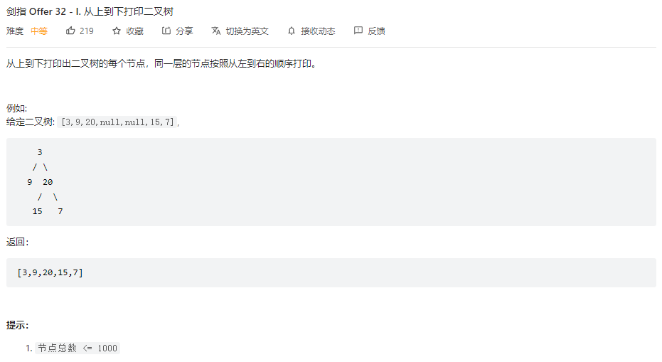

## 题目

题目地址：[32- I. 从上到下打印二叉树](https://leetcode.cn/problems/cong-shang-dao-xia-da-yin-er-cha-shu-lcof/)




## 思路

题目的本意是实现二叉树的**层序遍历**，层序遍历的核心是使用 **队列**

通过队列的 **先进先出** 特点，能够保证队列中的节点满足层序要求


## 参考代码

```go
/**
 * Definition for a binary tree node.
 * type TreeNode struct {
 *     Val int
 *     Left *TreeNode
 *     Right *TreeNode
 * }
 */
func levelOrder(root *TreeNode) []int {
    result := make([]int, 0)

    if root == nil {
        return result
    }

    queue := make([]*TreeNode, 0)
    queue = append(queue, root)

    for len(queue) > 0 {
        n := queue[0]
        
        if n.Left != nil {
            queue = append(queue, n.Left)
        }
        if n.Right != nil {
            queue = append(queue, n.Right)
        }

        queue = queue[1:]

        result = append(result, n.Val)
    }

    return result
}
```

