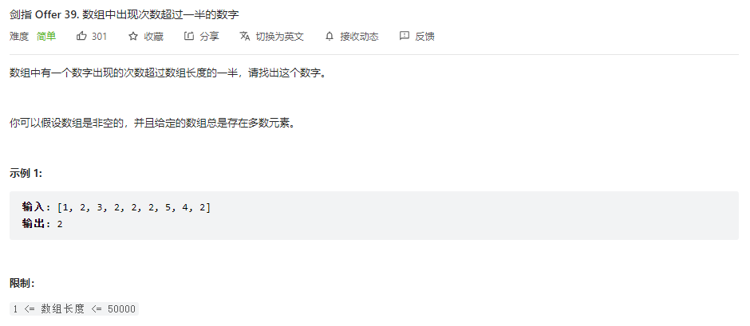

## 题目

题目地址：[39-数组中出现次数超过一半的数字](https://leetcode.cn/problems/shu-zu-zhong-chu-xian-ci-shu-chao-guo-yi-ban-de-shu-zi-lcof/)




## 思路

因为某个数字的个数超过数组长度的一半，所以可以使用统计法

维护两个变量：一个是众数 result，一个是当前统计 count

遍历数组，对于遍历过程的每一个数

* 如果 count 为 0，则先让这个数成为众数，再进行下面的判断
* 如果 count 不为 0，且与当前众数相等，那么 count +1
* 如果 count 不为 0，且与当前众数不相等，那么 count -1

遍历结束后，众数 result 就是最终的结果值


## 视频地址

https://www.bilibili.com/video/BV12U4y1i77M


## 参考代码

```go
func majorityElement(nums []int) int {
    result, count := 0, 0

    for _, v := range nums {
        if count == 0 {
            result = v
        }

        if result == v {
            count++
        } else {
            count--
        }
    }

    return result
}
```
