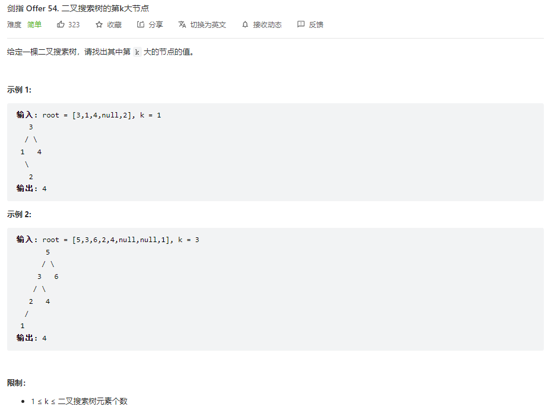

## 题目

题目地址：[54-二叉搜索树的第k大节点](https://leetcode.cn/problems/er-cha-sou-suo-shu-de-di-kda-jie-dian-lcof/)




## 思路

二叉树的**中序遍历**结果是：节点从小到大的排列

使用中序遍历的思路，对中序遍历做个变种：先访问右子树，再访问根节点，最后访问左子树

在访问根节点时做计数，如果计数等于 k 值，直接返回该节点的值即可


## 视频地址

https://www.bilibili.com/video/BV1eU4y1i72r


## 参考代码

```go
/**
 * Definition for a binary tree node.
 * type TreeNode struct {
 *     Val int
 *     Left *TreeNode
 *     Right *TreeNode
 * }
 */
func kthLargest(root *TreeNode, k int) int {
    var dfs func(*TreeNode)
    var count = 0
    var result = 0

    dfs = func(node *TreeNode) {
        if node == nil {
            return
        }

        // 处理右子树
        dfs(node.Right)
        // 处理根节点
        count++
        if count == k {
            result = node.Val
            return
        }
        // 处理左子树
        dfs(node.Left)
    }

    dfs(root)

    return result
}
```

